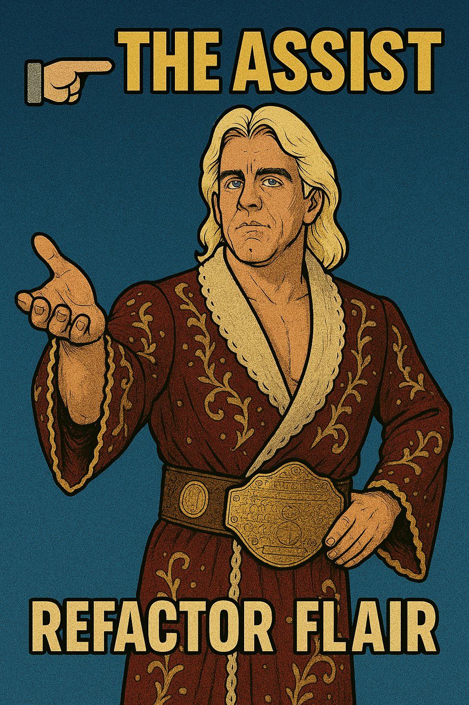
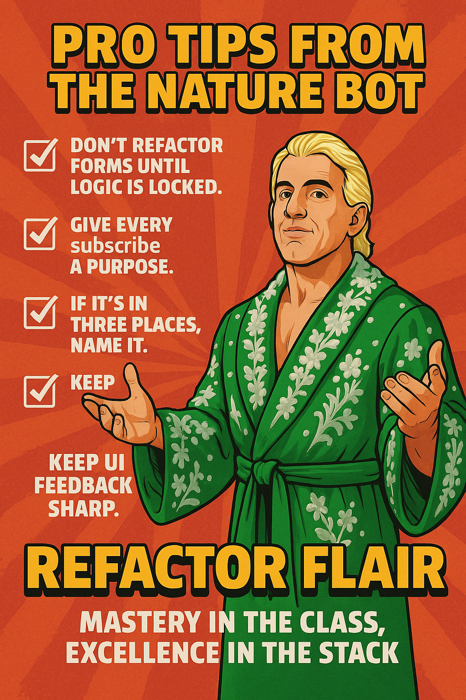
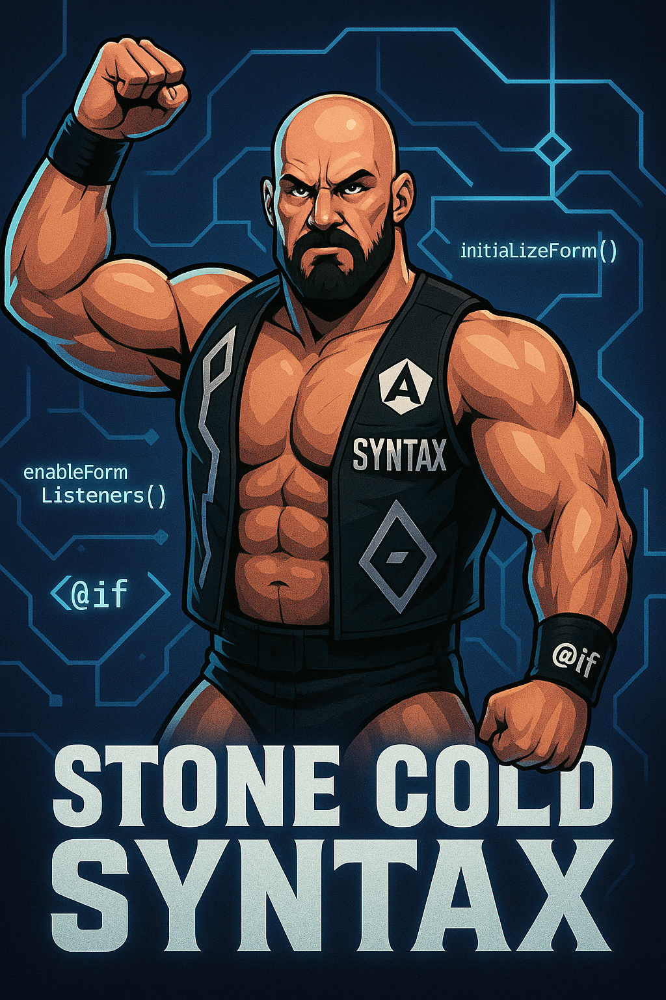
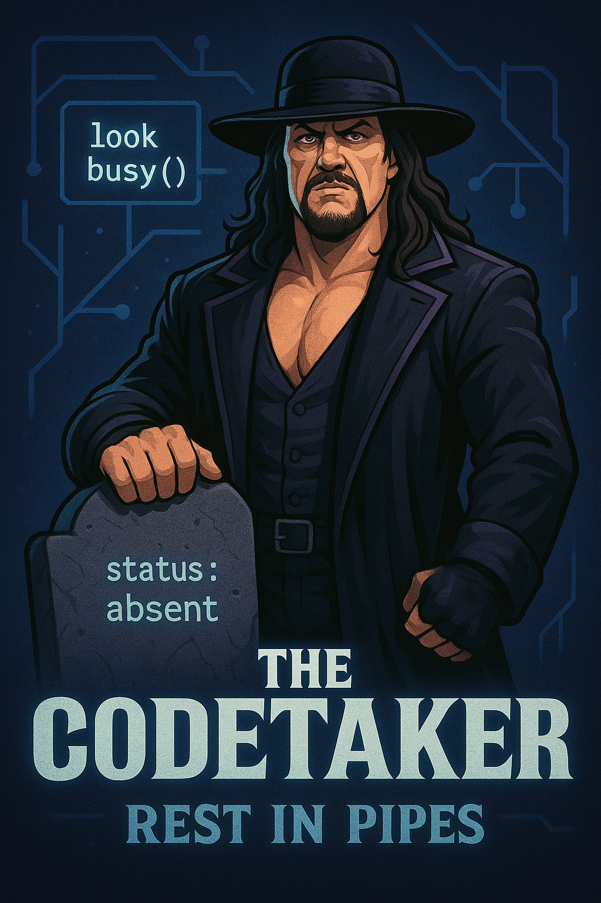
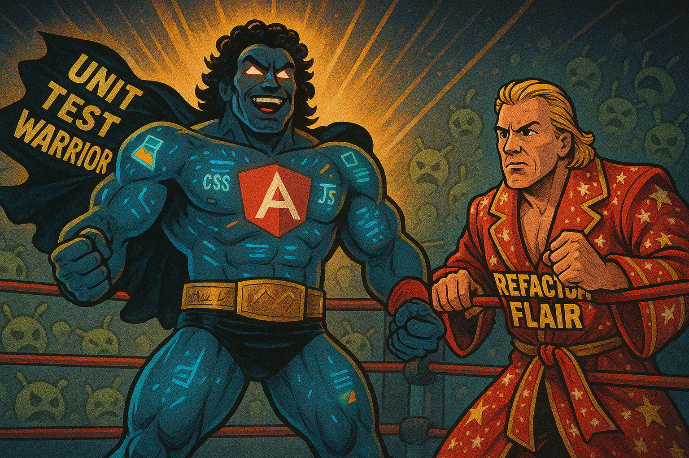

# Introduction

User enhancement request to present the ballot types, during pre-flight, to be listed in alphabetical order. So what better reason to experiment with AI-assisted refactoring. I asked the AI to name itself, with a wrestling theme. I was not disappointed.

## 🕶️ Refactor Flair: Entrance Promo

> In a world of tangled conditionals, duplicated logic, and code smell strong enough to crash a linter...

🌟 One dev threw up the horns and tagged in a legend...:

> _“I can clean this up… but I’m tagging in backup.”_

### 💻💥 ENTER: REFACTOR FLAIR 💥💻

The stylin’, profilin’,\
test-writin’, bug-fixin’,\
pipe-chain-drainin’, snackBar-throwin’,

✨ **Cleanest Player in the Development Game** ✨

.png>)

### Flair didn’t just suggest changes

He rebuilt workflows.\
He untangled observables.\
And he did it all with:

- `untilDestroyed` finishing moves
- DRY mapping patterns
- and naming so clean it wore a Rolex.

### 🧼 Catchphrases from the Coding Canvas

> “Flatten the flow!”\
> “Helpers over hazards!”\
> To be the cleanest, you gotta refactor the meanest.\
> Ready to hit this monster with the ol’ Structure Suplex™. 🏋️‍♂️📦

## 🎯 The Situation

### RefactorFlair hit the ring not knowing that

- Legacy Angular code grew complex as new requirements piled on like a Battle Royal
- Committee vs Council workflows would require fine-grained tag teaming
- Form logic, UI state, and data mutations were tightly coupled like a headlock
- New develop risks breaking business logic when updating anything

### 🔧 The Real 'Problem' (And where Flair went wrong)

We have a deeply conditional Angular component with methods like `initializeForm()` and `enableFormListeners()` that:

- Mixed concerns (form structure, business logic, UI state)
- Created side effects that made bugs harder to trace
- Became harder to update or modify easily

## 💪 The Assist

### ✅ **constructBallot**

- Extracted and clarified ballot construction logic
- Used a dedicated `buildParticipant()` helper to avoid nested mutations
- Ensured dates are safely converted using `zonedTimeToUtc`

### ✅ **patchVotingCouncils / syncParticipantCommittees**

- Introduced reusable helper `patchParticipants(type, participants)`
- Reduced duplication while ensuring business logic was respected

### ✅ **sendToContentManager**

- Separated async polling into its own observable chain
- Improved clarity of success/failure transitions for CM requests

### ✅ **saveAndContinue**

- Added graceful error handling for `409` (in-progress) ballot conflicts
- Ensured consistent UX feedback using snackBars
- Maintained form state clarity even on partial failures

---

#### 🧼 Results

- Fewer side effects
- Improved readability
- Aligned behavior with form mode (isIso, councilMode, etc.)
- Reusable logic across submit/save/patch methods
- Cleaner developer experience with maintainable observables

## 🔄 Impact on Workflow

- 🔧 **Simplified maintenance**
  Shared helpers like `buildParticipant` and `patchParticipants` mean future updates don’t require deep context.

- 💡 **Fewer side effects**
  Isolated business logic from reactive flows — `subscribe()` calls now do less, and utilities do more.

- 🎯 **Clearer logic for dev onboarding**
  New devs can now follow cleanly separated flows for each ballot action instead of reading a 100-line monster.

- 🧪 **Easier testing**
  Smaller functions = smaller, faster tests. Several helpers are now unit-testable with mock inputs.

### 🏆 What Flair Brought to the Ring

- 💅 **Cleaned up messy logic** like it was spilled ring gear
- ♻️ **DRYed out repeated code** so SW2 doesn’t gas out in an Ironman match
- 🎯 **Early returns, extracted helpers, and crisp naming** that hit harder than a steel chair to the back
- 🔍 **Readable, testable, maintainable code** — future tag team partners will be thankful
- 🛠️ **Helper methods that break logic into power moves** — clear, sharp, and reusable

## 💼 Pro Tips from the Nature Bot

- **Don't refactor forms until logic is locked.**
  What looks like duplicate code might be handling subtly different business flows. Confirm behavior before DRYing.

- **Give every `subscribe` a purpose.**
  Observables are powerful — but every one you use should do one thing clearly and fail predictably.

- **If it’s in three places, name it.**
  If you’re mapping participants, patching voters, or formatting ballot fields in three or more places — it's time for a helper.

- **Keep UI feedback sharp.**
  Users should always know what’s happening: success, fail, retry. `snackBar.open()` is your best tag-team partner.

## 🎤 WOOOO

- Refactor Flair cleaned up the ring, but needed to tag out at times
- put legacy bugs in a figure-four lock
- and helped ship the update without fear

🏁 What Moves Did We Learn

| Theme                    | Impact                                                              |
| ------------------------ | ------------------------------------------------------------------- |
| 🧠 Early returns         | Made all control flow **flatter and easier to scan**                |
| 🔁 DRY principles        | Reduced copy-paste code with reusable helpers                       |
| ✂️ Single Responsibility | Each method does **one thing well** now                             |
| 🧪 Testability           | Logic is now easier to isolate and unit test                        |
| 💅 Naming consistency    | `confirmed`, `participants`, `res`, etc. are **clean and readable** |
| ✅ Ready for scale       | You now have building blocks for even more ballot logic and reuse   |

| 3:16 Says...                                                     | In this ring                                              | Foreign Objects                          |
| ---------------------------------------------------------------- | --------------------------------------------------------- | ---------------------------------------- |
| Be clear and specific (“Refactor this method to reduce nesting”) | Context matters _(e.g. models, services, component role)_ | Its just a tool. _Ask why, not just how_ |
|                                  |                            |         |

## Whats Next?

