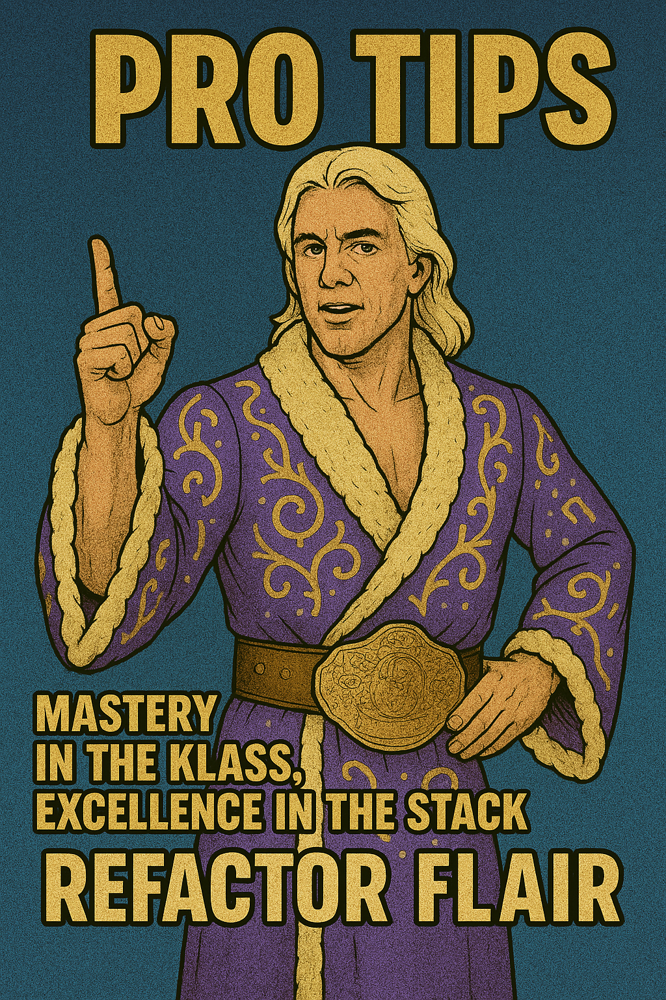

# 🕶️ Refactor Flair: Entrance Promo

In a world of tangled conditionals, duplicated logic, and code smell strong enough to crash a linter...

One dev said:

> _“I can clean this up… but I’m tagging in backup.”_

## **ENTER: REFACTOR FLAIR**

The stylin’, profilin’, test-writin’, bug-fixin’, pipeline-pleasin’,
✨ **Legend Killer of Legacy Code** ✨

.png>)

And he did it all with:

- `untilDestroyed` finishing moves
- runtime-safe branching
- DRY mapping patterns
- and naming so clean it wore a Rolex.

---

## 🎯 Demo Breakdown: The Situation

- Legacy Angular code grew complex as new requirements piled on
- Committee vs Council workflows required fine-grained control
- Form logic, UI state, and data mutations were tightly coupled
- Developers risked breaking business logic when updating anything

---

## 💪 Demo Breakdown: The Assist

### ✅ **constructBallot**

- Extracted and clarified ballot construction logic
- Used a dedicated `buildParticipant()` helper to avoid nested mutations
- Ensured dates are safely converted using `zonedTimeToUtc`

### ✅ **patchVotingCouncils / syncParticipantCommittees**

- Introduced reusable helper `patchParticipants(type, participants)`
- Reduced duplication while ensuring business logic was respected

### ✅ **sendToContentManager**

- Separated async polling into its own observable chain
- Improved clarity of success/failure transitions for CM requests

### ✅ **saveAndContinue**

- Added graceful error handling for `409` (in-progress) ballot conflicts
- Ensured consistent UX feedback using snackBars
- Maintained form state clarity even on partial failures

---

## 🔄 Impact on Workflow

- 🔧 **Simplified maintenance**
  Shared helpers like `buildParticipant` and `patchParticipants` mean future updates don’t require deep context.

- 💡 **Fewer side effects**
  Isolated business logic from reactive flows — `subscribe()` calls now do less, and utilities do more.

- 🎯 **Clearer logic for dev onboarding**
  New devs can now follow cleanly separated flows for each ballot action instead of reading a 100-line monster.

- 🧪 **Easier testing**
  Smaller functions = smaller, faster tests. Several helpers are now unit-testable with mock inputs.

---

## 💼 Pro Tips from the Nature Bot

- **Don't refactor forms until logic is locked.**
  What looks like duplicate code might be handling subtly different business flows. Confirm behavior before DRYing.

- **Give every `subscribe` a purpose.**
  Observables are powerful — but every one you use should do one thing clearly and fail predictably.

- **If it’s in three places, name it.**
  If you’re mapping participants, patching voters, or formatting ballot fields in three or more places — it's time for a helper.

- **Keep UI feedback sharp.**
  Users should always know what’s happening: success, fail, retry. `snackBar.open()` is your best tag-team partner.

---

## 🎤 WOOOO!

Refactor Flair cleaned up the ring,
put legacy bugs in a figure-four lock,
and helped the team ship features without fear.

> **The form is pristine, the ballot flows crisp, and the commit history? Legendary.**

**WOOOO!**

---
